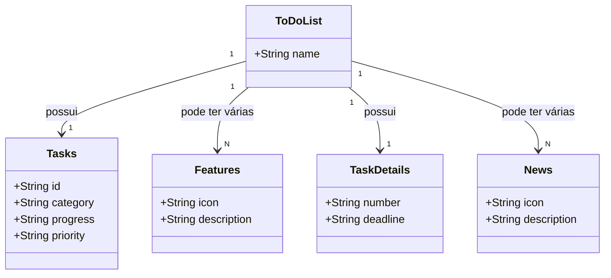

## To do List

```mermaid
classDiagram
    class ToDoList {
        +String name
    }

    class Tasks {
        +String id
        +String category
        +String progress
        +String priority
    }

    class Features {
        +String icon
        +String description
    }

    class TaskDetails {
        +String number
        +String deadline
    }

    class News {
        +String icon
        +String description
    }

    %% Relações do Banco de Dados
    ToDoList "1" --> "1" Tasks : possui
    ToDoList "1" --> "N" Features : pode ter várias
    ToDoList "1" --> "1" TaskDetails : possui
    ToDoList "1" --> "N" News : pode ter várias
```

